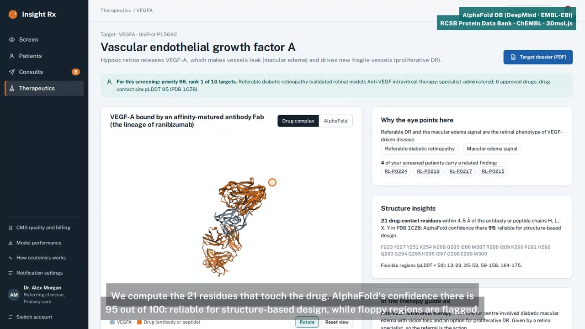
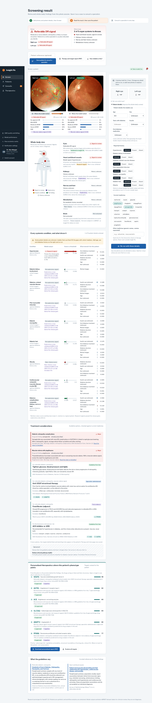
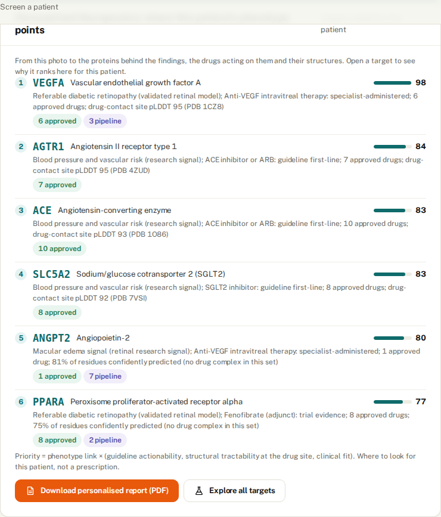
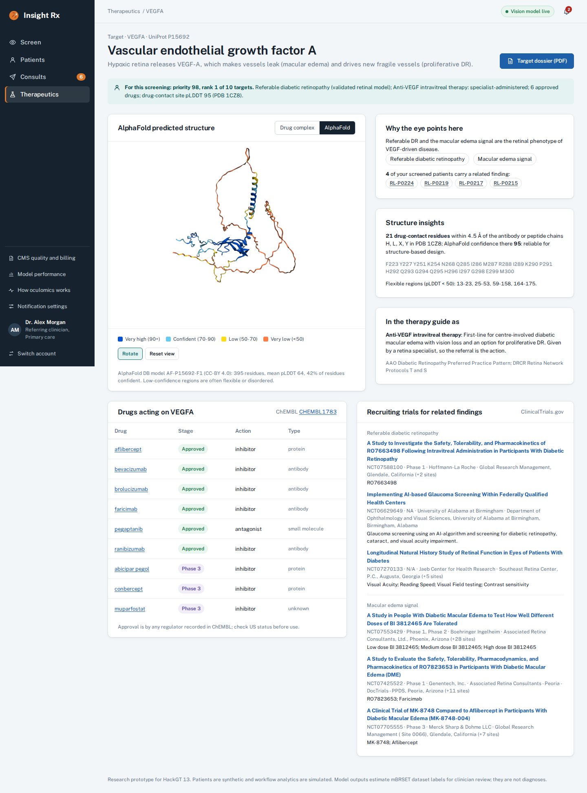
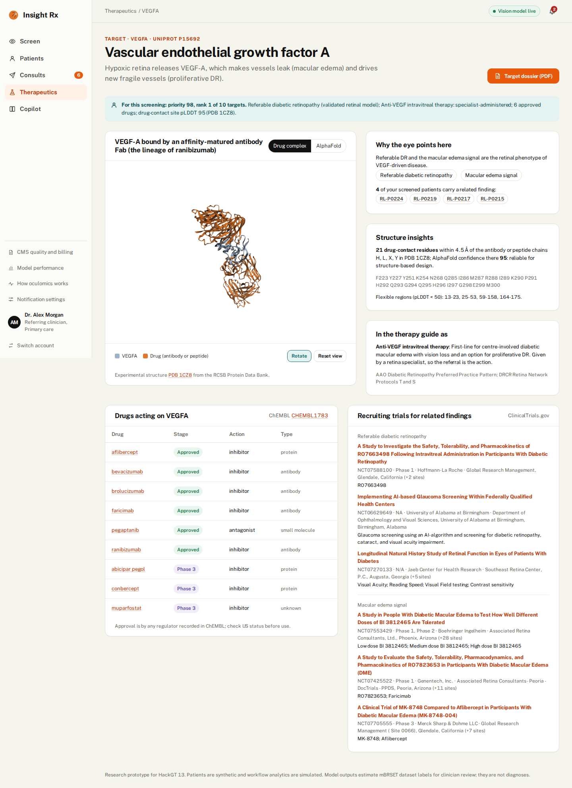
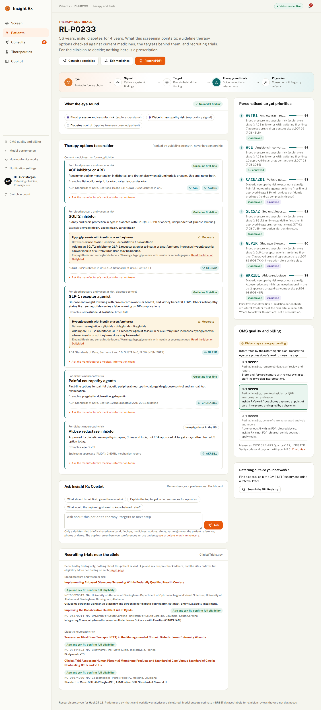
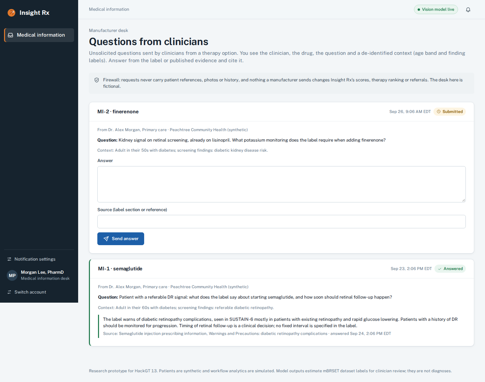
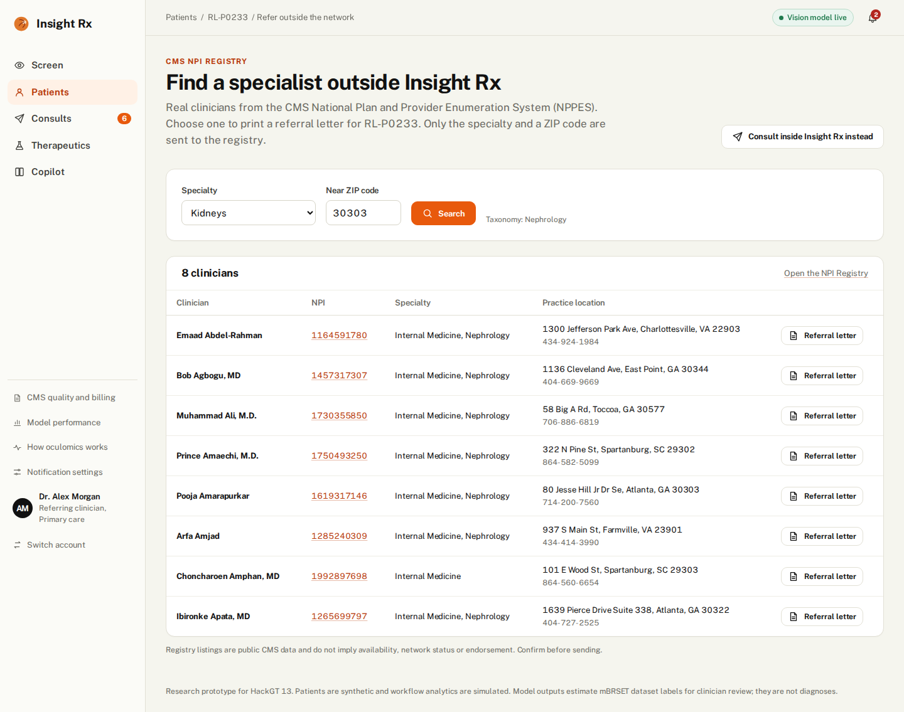
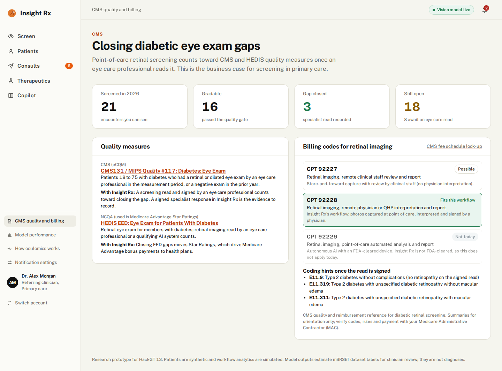
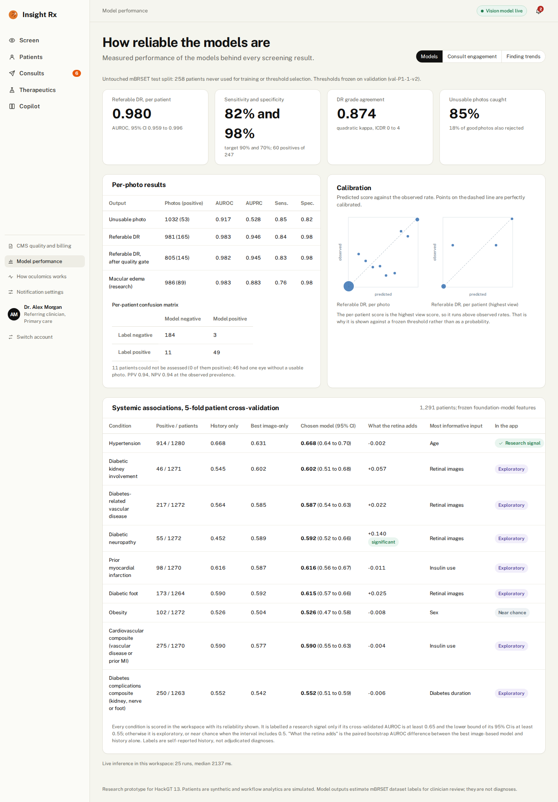

# Insight Rx

> **Insight Rx is a new HCP engagement channel triggered by a clinical signal: one no-needle eye photo tells the clinician what to treat, which protein and drug to target, and who to engage next (a specialist, a trial or the manufacturer).**

**HackGT 13 · Impiricus challenge: "Invent the next way we engage HCPs."** Team **Coding Claws**: Nagur Shareef Shaik, Sahith Reddy Thummala, Pranav Nagothu and Geethanjali Nagaboina.

[](docs/demo/InsightRx_demo.mp4)

**▶ [Watch the demo video](docs/demo/InsightRx_demo.mp4)** (5:35, narrated, captioned; [captions .srt](docs/demo/InsightRx_demo.srt)) · **[Live app](https://insightrx-hcp.vercel.app)** (access code on request) · **[User guide](docs/USER_GUIDE.md)** · **[Architecture](docs/ARCHITECTURE.md)** · **[Impiricus fit and judging scorecard](docs/IMPIRICUS_FIT.md)** · **[Sample PDF reports](docs/reports/)** · **[Portable inference (ONNX)](docs/PORTABLE_INFERENCE.md)**

### Why it wins

| Judging criterion | Insight Rx |
|---|---|
| **Impact on the HCP** | At the moment of decision, one photo gives a referable-DR verdict with attention maps, a whole-body view, guideline therapy with eye-specific drug-safety alerts, ranked protein targets, trials, and a one-click consult or referral letter. It also closes the diabetic eye-exam quality gap the clinician is measured on. |
| **Originality** | Screening tools stop at "refer". Insight Rx carries the retinal phenotype to the **protein target, drug and physician for each patient**, and measures **AlphaFold confidence at the exact drug-contact residues** from real PDB complexes. |
| **Technical execution** | DINOv2-L + LoRA ensemble trained on real Brazilian portable-camera data: **AUROC 0.980** on held-out patients. Live GPU worker, FastAPI on Vercel with Neon, strict CSP, tenant and role isolation, audit trail, 44 tests, and a reproducible demo pipeline. |
| **Commercial fit** | **Manufacturers** pay per qualified med-info engagement and trial referral, inside a compliance firewall. **Clinics** pay per screen, offset by CPT 92228 reads (about $30 each) and quality bonuses. **Impiricus** gains a non-SMS channel on its HCP network plus eye-detected demand per protein target. Per 10,000 patients: 3,520 exam gaps closeable, about $304K in billable reads, and 2,600 people with retinopathy found. |

### MLH: Best Use of Backboard

**Insight Rx Copilot** gives each clinician an evidence-grounded assistant with **persistent memory**, built on [Backboard.io](https://backboard.io):
- **Retrieval over Insight Rx's own knowledge.** Guideline therapy classes, interaction rules, protein targets with AlphaFold structure insights, CMS quality and billing rules, and guideline passages are uploaded once to a base assistant.
- **Memory per clinician.** Each clinician gets a private clone of that assistant, so Backboard's memory learns *their* preferences, practice patterns and follow-up intentions across sessions and patients, never mixing clinicians.
- **A thread per patient,** so context carries across visits. Every answer shows which remembered facts and documents it used.
- **A memory page** (`/copilot`) where clinicians see, add and delete what the copilot remembers.
- **Privacy.** Only a de-identified brief is sent (age band, finding labels, medicines, options, alerts, targets), checked by the same restricted-pattern guard as the Gemini path. The LLM is Gemini 2.5 Flash routed through Backboard.

For the Impiricus challenge, memory is what turns a one-off answer into an ongoing, personalised HCP relationship. Code: `insightrx/app/copilot.py`, `insightrx/app/routes_copilot.py`, `tests/test_copilot.py`. Set `BACKBOARD_API_KEY` to enable it.

### Screenshots

| Screen result | Personalised targets | AlphaFold target view |
|---|---|---|
|  |  |  |
| **Drug complex (PDB)** | **Therapy and trials** | **Medical-information desk** |
|  |  |  |
| **NPI Registry referral** | **CMS quality and billing** | **Model performance** |
|  |  |  |

All 26 screens are in [docs/screenshots](docs/screenshots/), and the [user guide](docs/USER_GUIDE.md) walks through them.

## How it works

A portable retinal photo taken in primary care often leads nowhere. The result sits in a chart, the referral is a fax, and nobody knows whether the retina specialist ever saw the patient. Insight Rx makes that photo the start of an accountable exchange between two clinicians:

1. **Screen.** An operator uploads fundus photos. A local vision model checks suitability and image quality, records coverage for each eye, and estimates a referable-DR signal plus research systemic-association signals.
2. **Review.** The referring HCP accepts or overrides the model output and signs their own interpretation. The model output and the clinician's interpretation are always shown as separate things.
3. **Engage.** Insight Rx builds a consultation package in which every statement is traced to case data. It includes an evidence brief drawn from curated guidelines. The HCP signs it and sends it to a specialist from an approved directory.
4. **Close the loop.** The specialist explicitly acknowledges the request, asks for more information, or declines it. They then return a signed response. A coordinator schedules the visit and tracks access barriers. The handoff only closes when the referrer acknowledges the response.

This is a new engagement channel: **HCP-to-HCP engagement triggered by a clinical signal**, not marketing and not SMS. It has an action inbox, due-time tracking, notification preferences, and analytics on acknowledgement latency and completion.

5. **Therapy and trials.** Each finding maps to guideline therapy classes (ADA, AAO, KDIGO) ranked by guideline strength only, checked against the patient's current medicines for drug-drug and drug-disease interactions (for example semaglutide with a DR signal, pioglitazone with macular edema, dual RAS blockade). Each class links to its molecular targets with **AlphaFold** structures (coloured by pLDDT) and **PDB drug complexes** in a 3D viewer, the **ChEMBL** drugs acting on them, and recruiting **ClinicalTrials.gov** studies near the clinic with an age/sex pre-check.
6. **CMS.** Refer outside the network through the **CMS NPPES NPI Registry** with a printable referral letter, and see where each encounter stands against **CMS131 / MIPS #117 and HEDIS EED** (diabetic eye exam), with the retinal-imaging CPT codes (92227/92228/92229) that fit the workflow.
7. **Medical information.** From any therapy option a clinician can ask the manufacturer's medical-information desk a question. The desk sees the clinician, the drug, the question and a de-identified context (age band and finding labels) only, cannot open cases, and nothing it sends changes scores, ranking or referrals. The desk in the demo is fictional.

The retina does not discover drugs. It shows which disease process is active, and that phenotype prioritises targets, therapies and trials. Therapy content is guideline or label-sourced, cited on every card, and never a prescription.

> Research prototype. Every patient is synthetic and the workflow analytics are **simulated**. Model outputs estimate mBRSET dataset labels for clinician review; they are not diagnoses.

## Models (mBRSET only)

| Component | What it is |
|---|---|
| Image model | DINOv2-L at 392 px, LoRA (r16) on q/v, last 4 blocks unfrozen, one multi-task head set: **unusable-image**, **referable DR (ICDR ≥ 2)**, **ICDR 0–4 (CORAL ordinal)**, **macular edema**, plus 7 auxiliary systemic heads. Uses horizontal-flip TTA and a 2-seed ensemble. |
| Calibration | Per-head temperature scaling on validation. Thresholds are frozen on validation: quality gate at unusable recall ≥ 95%, patient DR threshold at sensitivity ≥ 90%. |
| Cascade | Quality gate → maximum over assessable views per eye → patient positive if either eye is positive. If either eye has no assessable image, the result is **incomplete**, never reassuring. |
| Systemic heads | 7 reported conditions + 2 composites, **5-fold patient cross-validation over all 1,291 patients**. Features: frozen RETFound (224/448 px) or DINOv2-L embeddings, which never saw the labels, pooled over quality-ok images; metadata = age, sex, diabetes duration, insulin, oral treatment. Variants: metadata-only, image-only and fused (logistic regression); the best out-of-fold variant is chosen. A head is enabled only if CV AUROC ≥ 0.65 **and** its patient-bootstrap 95% CI lower bound is ≥ 0.55; otherwise it shows **Not evaluated**. |
| Split | Frozen patient-grouped 70/10/20 split (OculoMoE protocol P1: 904/129/258 patients). The test set is untouched until evaluation. |

### Results (untouched test split: 258 patients / 1,032 images, exp 1)

| Endpoint | Unit | AUROC (95% CI) | Sens / Spec at frozen threshold |
|---|---|---|---|
| **Referable DR (ICDR ≥ 2)** after the quality gate | patient (n=247, 60 positive) | **0.980** (0.959–0.996) | **81.7% / 98.4%** · PPV 0.94 · NPV 0.94 |
| Referable DR | image (n=981) | 0.983 | 83.6% / 97.8% |
| Macular edema (research) | image (n=986) | 0.983 | 76.4% / 98.3% |
| ICDR 0–4 | image | quadratic κ **0.874**, accuracy 88.6% | – |
| Unusable image (quality gate) | image (53 unusable) | 0.917 | recall 84.9%, falsely rejects 17.9% of usable images |

#### Systemic associations (5-fold patient CV, out-of-fold)

| Target | Pos / n | Metadata only | Best image-only | Chosen (95% CI) | Retinal added value (95% CI) | Status |
|---|---|---|---|---|---|---|
| Hypertension | 914 / 1280 | 0.668 | 0.631 | **0.668** (0.636–0.700), metadata | −0.002 (−0.03, +0.03) | **enabled** |
| Nephropathy | 46 / 1271 | 0.545 | 0.602 | 0.602 (0.51–0.69), RETFound 448 image | +0.057 (−0.05, +0.18) | not evaluated |
| Vascular disease | 217 / 1272 | 0.564 | 0.585 | 0.587 (0.54–0.63), RETFound fused | +0.022 (−0.03, +0.07) | not evaluated |
| Neuropathy | 55 / 1272 | 0.452 | 0.589 | 0.592 (0.52–0.66), DINOv2 fused | **+0.140 (+0.03, +0.25)** | not evaluated |
| Prior MI | 98 / 1270 | 0.616 | 0.587 | 0.616 (0.56–0.67), metadata | −0.011 | not evaluated |
| Diabetic foot | 173 / 1264 | 0.590 | 0.592 | 0.615 (0.57–0.66), RETFound fused | +0.025 | not evaluated |
| Obesity | 102 / 1272 | 0.526 | 0.504 | 0.526, metadata | −0.008 | not evaluated |
| Cardiovascular composite | 275 / 1270 | 0.590 | 0.577 | 0.590, metadata | −0.004 | not evaluated |
| Diabetes complications composite | 250 / 1263 | 0.552 | 0.542 | 0.552, metadata | −0.006 | not evaluated |

What this shows:

- In mBRSET, retinal images add a statistically supported signal only for **neuropathy**, and that head is still too weak to release.
- Hypertension is enabled, but on age, sex and diabetes history alone; the workspace says so.
- The chosen variant is selected among 7 on the same folds, so it is mildly optimistic.
- The first run used a gradient-boosting metadata baseline. It overfit rare targets (nephropathy 0.35, below chance) and was replaced with regularised logistic regression.
- The fine-tuned-model systemic heads evaluated on the P1 split are kept for reference in `weights/metrics/systemic_metrics.json`.

**Missed targets and threshold history.** G2 (sensitivity ≥ 90%) and G3 (unusable recall ≥ 95%) are **not met**.

- **v1 threshold:** set at 90% patient sensitivity on only 28 validation positives. It gave 73.3% / 99.5% on test.
- **v2 threshold (in use):** set at 90% image sensitivity on the gated validation images. This rule was adopted **after** looking at the v1 test result. The v1 metrics are kept in `metrics/image_metrics_v1_patient_threshold.json`.
- **What the model could do:** the ROC curve reaches about 92% sensitivity at 96% specificity. A larger validation set, or cross-fitted thresholds, is the next step; the threshold should not be re-tuned on the test set.

Full metrics: `metrics/image_metrics.json` and `metrics/systemic_metrics.json` under the output directory. The app shows them under **Analytics → Model performance**.

### Outputs and checkpoints

The released weights used by the app are in [`weights/`](weights/), stored with Git LFS: two image checkpoints (199 MB each), `systemic_cv.joblib`, `calibration.json` and aggregate metrics only. No per-patient outputs or mBRSET images are included, and the repository must stay **private** (see Data use below). Training writes everything to `/data/users3/nshaik3/Projects/Oculomics/RetiLink/<INSIGHTRX_EXP_NO>/`:

```
splits.json  label_audit.json  calibration.json
ckpt/image_seed42.pth  ckpt/image_seed43.pth  ckpt/*_history.json  ckpt/systemic_cv.joblib
features/  metrics/
```

### Train

```bash
# SLURM (2 GPUs, one seed per GPU)
ssh nshaik3@arctrdlogin001.rs.gsu.edu
cd /home/users/nshaik3/Desktop/Oculomics/RetiLink && sbatch scripts/JobSubmit.sh
INSIGHTRX_SMOKE=1 sbatch --export=ALL scripts/JobSubmit.sh            # 5-minute end-to-end check

# or one local GPU, seeds run one after the other
GPU=0 INSIGHTRX_EXP_NO=1 bash scripts/train_local.sh
```

## Oculomics: the whole-body view

The retina is the only place where blood vessels and nerve tissue can be seen directly, without a needle. Insight Rx presents what one retinal session can say about the whole patient, and it never claims a diagnosis.

- **Oculomics, "How it works" tab.** An illustrated retina: pointing at vessels, lesions, macula or optic nerve highlights the organ systems each feature informs. Next to it are the evidence ladder and the path from photo to signed answer, plus published context (Poplin 2018, Sabanayagam 2020, RETFound 2023), labelled as literature rather than Insight Rx results.
- **Oculomics, "Your panel" tab.** A population dashboard for the clinician's own patients:
  - a body map with counts per organ;
  - organ-by-organ stacked bars (signal, exploratory, known, unknown history, clear);
  - a "Patients to review" queue.

  It is scoped by role: referrers see their own cases, specialists see cases referred to them, and administrators see none.
- **Case, Systemic health tab.** A per-patient whole-body map and organ list, with a matching snapshot card on the Screening tab.

Every systemic condition is scored, and the reliability travels with each score:

| Label | Rule | Conditions today |
|---|---|---|
| **Research signal** (amber) | CV AUROC ≥ 0.65 and lower CI bound ≥ 0.55 | Hypertension |
| **Exploratory signal** (purple) | Below the gate, CI lower bound > 0.5 | Kidney, vascular disease, neuropathy, prior MI, diabetic foot, both composites |
| **Near-chance score** (neutral) | CI includes 0.5; shown but never flagged | Obesity |

Recorded history always takes precedence. A model signal only raises a flag for a condition that is not already recorded as present.

## Therapeutics layer

| Piece | Source | Where |
|---|---|---|
| Therapy classes per finding | Curated from ADA Standards of Care, AAO PPP, KDIGO 2022, pivotal trials | `insightrx/app/data/therapeutics.json` |
| Interaction rules | FDA labels and guidelines, each cited; not a complete checker | `insightrx/app/data/interactions.json` |
| Targets, structures | UniProt, AlphaFold DB (CC-BY 4.0), RCSB PDB (1CZ8, 4ZUD, 1O86, 7VSI, 7KI0, 4JIR) | `data/targets.json`, `public/static/structures/` |
| Drugs per target | ChEMBL mechanism records | `data/chembl_drugs.json` |
| Trials, NPI Registry, labels | ClinicalTrials.gov v2, CMS NPPES, openFDA: live, cached, snapshot fallback | `insightrx/app/external.py` |
| CMS quality and billing | CMS131 / MIPS #117, HEDIS EED, CPT 92227-92229 | `data/cms.json`, `/quality` |

**Personalised therapeutics.** Every screening (saved or not) ranks the targets its phenotype points to with a transparent priority index: phenotype link x (0.5 guideline actionability + 0.3 structural tractability at the drug-contact site + 0.2 clinical fit). Actionability comes from US guideline strength, so a drug approved only abroad does not lift a target. Target pages opened from a patient show that patient's rank and reasons.

**PDF reports** (reportlab, vector charts): a *patient therapy and target report* (from Screen before saving, or from a case), a *target dossier* (AlphaFold confidence track with UniProt features, a structure snapshot, drug-contact residues computed at 4.5 A from the PDB complex and mapped to UniProt numbering, drug landscape, trials and rule-based discovery insights) and a *portfolio report* (opportunity matrix of eye-detected demand vs approved drugs). `scripts/fetch_structures.py --insights-only` recomputes the structure analysis.

Only a fixed condition term or specialty and the clinic ZIP are ever sent to public APIs; no patient data leaves the app. Refresh the static data with `python scripts/fetch_structures.py` (`--snapshots-only` for trials and NPI snapshots). The 3D viewer is self-hosted 3Dmol.js (BSD-3), so the strict CSP stays `script-src 'self'`.

## Explainability

| What | How | Where in the app |
|---|---|---|
| DR / image-quality attention maps | Gradient × activation on patch tokens from the last 4 ViT blocks of both fine-tuned models, averaged. Masked to the fundus field of view, top 15% shown. Labelled as model attention, not lesion segmentation. | Retinal assessment → *Show model attention* under each image |
| Why this result | For each eye: which image drove the maximum, its score vs the frozen threshold and the margin, and ICDR grade probabilities. Also added to the consultation package as traced facts. | Retinal assessment side panel; consultation package |
| Systemic: this patient | Occlusion contributions: how the calibrated score changes when the retinal images or each metadata field are set to the cohort baseline. Also per-image scores and an attention map for image-based heads. | Systemic health → *Why / how reliable?* |
| Systemic: cohort level | Grouped permutation importance on held-out folds; CV AUROC with CI; paired "retinal added value" | same, plus Analytics → Model performance |
| Calibration | Reliability curves (test split for DR; out-of-fold for systemic heads) | Analytics → Model performance |

## App

FastAPI with server-rendered Jinja pages, a hand-built design system (`public/static`: about 6 KB of CSS gzipped, 5 KB of JS, a self-hosted variable font, an SVG icon sprite, no frameworks) and SQLAlchemy (SQLite by default; set `DATABASE_URL` to use Postgres). Vision inference runs on the local GPU.

```bash
python scripts/seed_demo.py --reset          # synthetic orgs, users, 5 scenario cases (local mBRSET images), simulated history
bash scripts/run_app.sh                       # uses ./weights (override with INSIGHTRX_MODEL_DIR)
# open http://127.0.0.1:8000  -> pick a role
```

Optional: put `GEMINI_API_KEY=...` in `.env` to have evidence briefs written by Gemini. Only the generic question and the curated public passages are sent; a guard blocks case, patient and image content. Without a key, or if the call fails, Insight Rx falls back to a deterministic template.

### Deploy for free: Vercel + GPU worker tunnel

```
browser ──► Vercel (FastAPI workspace, free Hobby) ──► Neon Postgres (free): cases, reviews, referrals, images
                         │  HTTPS + shared key
                         ▼
            Cloudflare quick tunnel (free, no account) ──► this machine: insightrx/vision_api.py on the GPU
```

- **Vercel** runs the whole HCP workspace: `api/index.py`, `vercel.json`, and the light dependencies in `requirements.txt`. Weights and training code are excluded from the bundle.
- **Model inference** stays on the research machine. `scripts/run_vision_tunnel.sh` starts the vision worker, opens a quick tunnel and registers the tunnel URL with the app every 5 minutes. When the worker is off, the site keeps working and shows **Vision model: SIMULATED**.
- **What travels:** only the images a user uploads go to the worker, and only scores and explanation maps come back. mBRSET images and the weights never leave this machine.

One-time setup:

1. Deploy with `vercel deploy --prod`, or import the GitHub repo in the Vercel dashboard.
2. In the Vercel project, open *Storage* → add **Neon** (free). This sets `DATABASE_URL`.
3. Add these environment variables:
   - `INSIGHTRX_SECRET`: random; signs sessions.
   - `INSIGHTRX_VISION_KEY`: random; the shared secret with the worker.
   - optional `GEMINI_API_KEY`.
4. On this machine, put `INSIGHTRX_VISION_KEY=<same>` and `INSIGHTRX_APP_URL=https://<project>.vercel.app` in `.env` (git-ignored), then run `bash scripts/run_vision_tunnel.sh` for the demo.

The database seeds itself with the synthetic workspace (no images) on first start.

Alternative, paid: `python scripts/deploy_space.py` builds a Hugging Face Docker Space from `deploy/space/` (needs HF PRO plus T4 hardware).

### Run on another device (ONNX, no PyTorch)

`python scripts/export_models.py` writes a self-contained ONNX bundle. It contains the LoRA-merged retina models, the systemic encoders and heads, calibration, a manifest with checksums, and a PyTorch-vs-ONNX parity report. Install `requirements-runtime.txt` on any device (CPU, NVIDIA, Apple Silicon or Windows DirectML) and set `INSIGHTRX_MODEL_DIR` to the bundle; `VisionService`, `scripts/predict.py` and the vision worker switch to ONNX Runtime automatically. Verdicts and systemic scores are identical to PyTorch (probabilities within 5e-7). See [docs/PORTABLE_INFERENCE.md](docs/PORTABLE_INFERENCE.md).

### Test on new retinal images

- **In the app: Try an image.** Upload up to 4 fundus photos to see the quality gate result, DR score against the frozen threshold, grade probabilities, edema signal and attention map. Nothing is stored. Large phone or camera photos are downscaled in the browser so they fit the upload limit.
- **In a case: New screening.** Drop right-eye and left-eye photos, then choose *Create and analyse*. You get the full two-eye assessment, the relay and the consultation workflow.
- **Batch, on the GPU machine:**
  ```bash
  python scripts/predict.py /path/to/images --out preds.csv --maps attention/ --labels labels.csv
  ```
  - `labels.csv` has columns `image` and `dr_referable` (0/1), or `icdr` (0–4). With it, the script prints AUROC, sensitivity and specificity at the frozen mBRSET threshold.
  - Public test sets to try: APTOS 2019 (Kaggle), Messidor-2, IDRiD, EyePACS/DDR. Check each licence first.
  - Expect domain shift: those sets use different cameras and populations, often without dilation, so a drop in performance or a need to recalibrate is expected and worth reporting.

### Demo script (3 minutes)

| Time | Account | What to show |
|---|---|---|
| 0:00 | – | The problem: retinal screening results rarely reach the specialist or come back. |
| 0:20 | Sam Rivera (operator) | *New screening*: drop photos of both eyes, then *Create and analyse* (under 2 s). Then open RL-P0104: only one eye is present, so the result shows **Assessment incomplete**. |
| 0:55 | Dr. Alex Morgan (referring) | Case RL-P0102. Show the **Referable DR signal** gauge, turn on *Model attention*, read *Why this result*, then open the Systemic health tab (recorded history, model association and clinician assessment kept separate). Sign. |
| 1:25 | Dr. Alex Morgan | Consultation tab. Enter a question and pick Dr. Priya Nair, preview the traced package with its evidence brief, then sign and send. |
| 1:55 | Dr. Priya Nair (specialist) | Inbox. Accept, then sign a response. |
| 2:20 | Taylor Brooks (coordinator) | Schedule the visit and add a transport barrier; the accountable owner changes. |
| 2:40 | Any | Analytics: workflow funnel (SIMULATED), then Model performance (real test metrics and limitations). |

### Tests

```bash
/data/users3/nshaik3/Projects/Oculomics/RetiLink/venv/bin/python -m pytest -q tests
```

The tests cover:

- **Case intake:** analysis is blocked when identity is missing; non-image uploads are rejected; duplicate images are detected.
- **Roles and access:** role checks; cross-tenant and unassigned access is denied.
- **Consultations:** a double-submitted referral creates only one referral; illegal state transitions are rejected; a signature is invalidated when the case changes; the recipient must be granted access.
- **Safety:** unusable or one-eye cases never produce a reassuring result; the Gemini payload guard works.
- **Full handoff:** a complete two-HCP exchange from send to close.

## Layout

```
insightrx/ml/    config, data, model, train_image, evaluate, frozen, systemic_cv, explain (train_systemic: P1-split reference)
insightrx/app/   main (routes), routes_therapy, therapeutics, personalize, external, reports, models, workflow (state machine / audit / tasks), vision, remote_vision, seed, llm, evidence, templates/
insightrx/vision_api.py  GPU vision worker API (used by the deployed app through the tunnel)
scripts/        JobSubmit.sh, train_local.sh, seed_demo.py, run_app.sh, run_vision_tunnel.sh, deploy_space.py, fetch_structures.py, export_models.py (portable ONNX bundle)
scripts/demo/   narrated demo video pipeline (Microsoft VibeVoice voice + Whisper alignment, Playwright recording, ffmpeg captions) + screenshots.py
api/, vercel.json  Vercel entry point + config (requirements.txt = web app deps; requirements-ml.txt = models)
deploy/space/   Dockerfile + pinned requirements for the Hugging Face Space
weights/        released checkpoints (Git LFS) + calibration + aggregate metrics
tests/          test_workflow.py, test_therapeutics.py
docs/           USER_GUIDE, ARCHITECTURE, IMPIRICUS_FIT, PORTABLE_INFERENCE, screenshots/, reports/ (sample PDFs), demo/ (video via Git LFS, captions, slides)
```

## Limitations

- The model was trained and tested on a single dataset: mBRSET (Phelcom Eyer portable camera, dilated eyes, people with diabetes in Brazil). It has not been validated on other cameras or populations.
- Systemic labels are self-reported history. Systemic outputs are associations for review, not diagnoses or risk predictions.
- Due dates, historical referrals and engagement analytics are simulated. No EHR integration, external messaging or real clinical data.
- Dataset: Nakayama LF et al., *mBRSET*, Scientific Data 2025; PhysioNet (credentialed access). mBRSET images are not redistributed and are never sent to external APIs.

## Data use

The weights in `weights/` were trained on credentialed PhysioNet data. Keep this repository and the Space **private** until redistribution of the trained models has been cleared under the mBRSET data use agreement.
