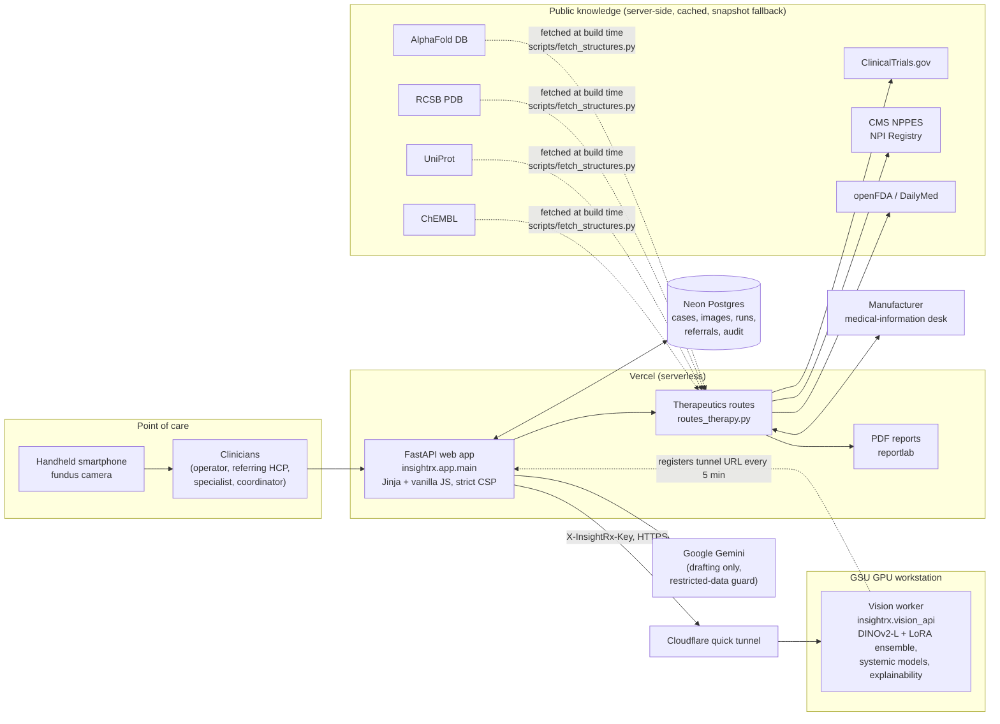
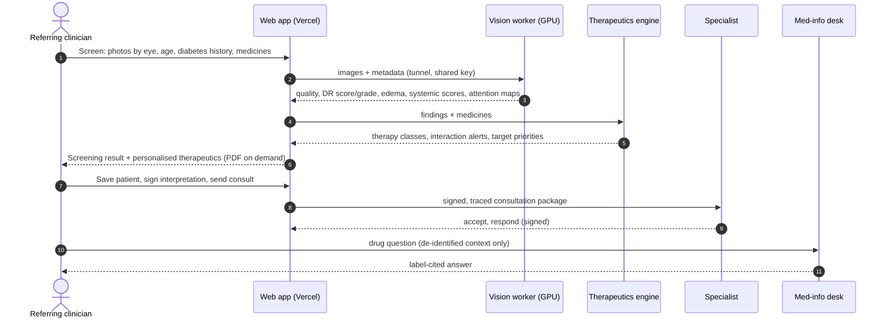
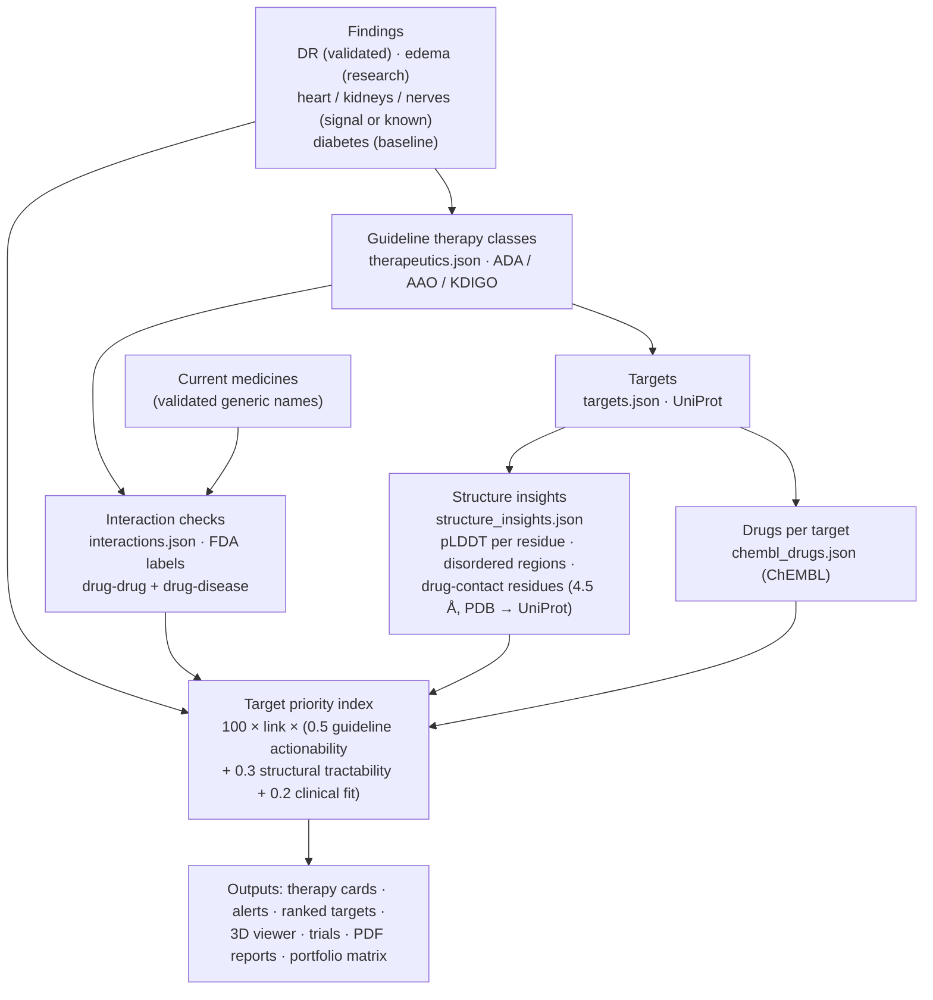
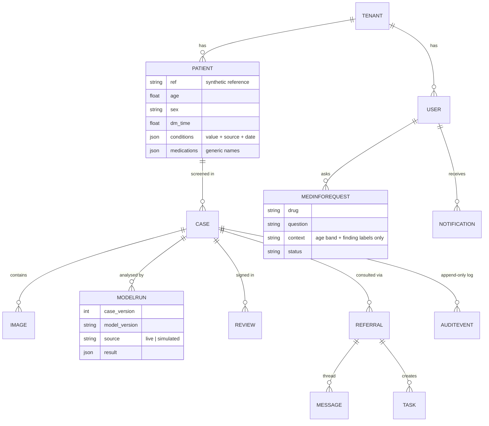
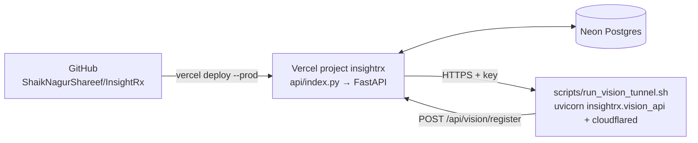

# Insight Rx: system architecture

> **Insight Rx is a new HCP engagement channel triggered by a clinical signal: one no-needle eye photo tells the clinician what to treat, which protein and drug to target, and who to engage next (a specialist, a trial or the manufacturer).**

Insight Rx turns one portable retinal photo into:
- a quality-gated diabetic retinopathy (DR) screen;
- a whole-body view of systemic risk;
- personalised, target-level therapy options;
- an accountable handoff to the right physician or manufacturer medical-information team.

This document covers how the pieces fit together, where the data comes from, and how privacy and safety are enforced.

- **Live app:** https://insightrx-hcp.vercel.app. It is protected by an access code because it shows credentialed mBRSET images.
- **Code:** https://github.com/ShaikNagurShareef/InsightRx
- **Team:** Coding Claws (HackGT 13): Nagur Shareef Shaik, Sahith Reddy Thummala, Pranav Nagothu and Geethanjali Nagaboina.

---

## 1. System overview



**Main design choices:**
- **Models run on a free GPU worker.** The web app stays small enough for Vercel, while the ViT-L models run on a GPU machine behind a Cloudflare tunnel. If the worker is unreachable, the app switches to a clearly labelled **SIMULATED** mode instead of failing.
- **Everything is server-rendered.** FastAPI and Jinja render the pages; JavaScript is only a progressive enhancement. The CSP is `script-src 'self'`, and even the 3D viewer is self-hosted.
- **Heavy public data is pre-computed.** AlphaFold models, PDB complexes, ChEMBL drugs and the structure analysis are fetched once, stored in the repo and served as static files. Live calls (trials, NPI Registry, labels) have short timeouts, a cache and checked-in snapshots.

---

## 2. Patient journey through the system



---

## 3. Components

### 3.1 Web app (`insightrx/app/`)

| Module | Responsibility |
|---|---|
| `main.py` | Starts the app: access-code gate, sessions, security headers and CSP. Holds auth, role checks and tenant scoping (`case_for`, `referral_for`). Routes: Screen, Patients, Consults, cases, reviews, referrals, analytics, the JSON API, and the vision-worker registration endpoint. |
| `routes_therapy.py` | The case "Therapy and trials" page, the target explorer and target pages, the NPI Registry referral and printable letter, CMS quality and billing, the medical-information channel, and the PDF report endpoints. |
| `models.py` / `db.py` | SQLAlchemy models (Tenant, User, Patient, Case, Image, ModelRun, Review, Referral, Task, Notification, AuditEvent, MedInfoRequest, ScreenResult) and additive migrations (`ensure_columns`). |
| `workflow.py` | Case and referral state machines, signatures and case versions, tasks, notifications with digest and quiet hours, and the append-only audit log. |
| `vision.py` / `remote_vision.py` | The local GPU service, or a remote client for the tunnel worker, with a health cache and SIMULATED fallback. |
| `oculomics.py` | The organ-level whole-body snapshot, with an evidence tier for each organ. |
| `therapeutics.py` | Maps findings to guideline therapy classes and runs the interaction and drug-disease checks. Also covers target data, pLDDT statistics, trial pre-checks, de-identified med-info context and CMS care-gap status. |
| `personalize.py` | The personalised **target priority index** and the per-patient bundle used by pages and PDFs. |
| `external.py` | Clients for ClinicalTrials.gov v2, CMS NPPES and openFDA. Each has a timeout, a TTL cache and a snapshot fallback. Outbound requests carry only fixed condition or specialty terms plus the clinic ZIP. |
| `reports.py` / `report_charts.py` | PDF reports (patient, target dossier, portfolio) with vector charts: structure snapshot, pLDDT track, drug landscape and opportunity matrix. |
| `consult.py`, `trylab.py`, `activity.py`, `evidence.py`, `llm.py` | The guided consult, Screen input parsing, activity statistics, the guideline evidence set, and the Gemini adapter with its restricted-data guard. |
| `templates/`, `public/static/` | Server-rendered UI, the design system (`app.css`), `app.js`, the 3D viewer (`molview.js` + self-hosted `3Dmol-min.js`), and structure files. |

### 3.2 Machine learning (`insightrx/ml/`, `insightrx/vision_api.py`)

| Model | Details |
|---|---|
| Retinal image model | DINOv2-L at 392 px with LoRA (r16, q/v) and the last 4 blocks unfrozen. Multi-task heads: quality, referable DR (ICDR ≥ 2), ICDR 0-4 (CORAL), macular edema and 7 auxiliary systemic heads. It is a 2-seed ensemble with horizontal-flip TTA, temperature scaling and validation-frozen thresholds. |
| Results | On held-out test patients, patient-level referable-DR **AUROC 0.980** (0.959-0.996), with sensitivity 81.7% and specificity 98.4% at the frozen threshold. See the README for every endpoint. |
| Systemic models | Frozen RETFound / DINOv2 features, metadata-only, image-only and fused variants, evaluated with 5-fold patient CV over 1,291 patients. A release gate (AUROC ≥ 0.65 and CI lower bound ≥ 0.55) sets whether each output is labelled research, exploratory or near chance. |
| Explainability | Gradient × activation over the last 4 ViT blocks, masked to the field of view. Occlusion contributions and reliability curves are on the Model performance page. |
| Data | **mBRSET** (PhysioNet, credentialed): 5,164 images from 1,291 people with diabetes in Itabuna, Bahia, Brazil, captured with a handheld Phelcom Eyer smartphone camera. Split 70/10/20 by patient. |

### 3.3 Therapeutics engine



**Honesty rules built into the engine:**
- Ranking is guideline-driven. Sponsored content is labelled, shown after the options, and never reorders anything; a test asserts this.
- US guideline strength drives actionability, so a drug approved only abroad (such as epalrestat) does not lift a target.
- The engine prioritises existing targets and drugs for a patient; it does not design molecules.

---

## 4. Data model (core)



---

## 5. Security, privacy and compliance

| Control | Implementation |
|---|---|
| Access gate | A site-wide access code (`INSIGHTRX_ACCESS_CODE`) protects credentialed images. It is checked before the session middleware and compared in constant time. |
| Roles and tenants | Operator, referring HCP, specialist, coordinator, admin and medinfo. Every case query is scoped by tenant and role (`case_for`). The **medinfo** desk can never open cases. |
| Signatures | Reviews bind the case version and model run; editing the case invalidates a signature. Referral sends are idempotent. |
| Audit | Append-only `AuditEvent` rows for model runs, signatures, referrals, PDF reports and med-info. |
| Web security | Strict CSP (`script-src 'self'`, no inline scripts), `X-Frame-Options: DENY`, `nosniff`, a referrer policy, upload type and size checks with a decompression-bomb bound, and escaped PDF text. |
| Outbound privacy | Public APIs receive only fixed condition or specialty terms and the clinic ZIP, never patient fields; tests assert this. Gemini never receives restricted data. |
| Med-info firewall | The desk sees the clinician, the drug, the question and an **age band plus finding labels**. It never sees the patient reference, images or history, and nothing it returns changes scores or ranking. |
| Secrets | Kept in `.env` (git-ignored) and Vercel env only. Legacy `RETILINK_*` names map to `INSIGHTRX_*`. |

---

## 6. Deployment



| Piece | How |
|---|---|
| Web | Vercel Python function (`api/index.py`). `vercel.json` rewrites everything except `/static/` to FastAPI, and static files are served by the CDN. |
| Database | Neon Postgres (`DATABASE_URL`). Additive schema upgrades run at startup, and demo data is backfilled when missing. |
| Models | Run `bash scripts/run_vision_tunnel.sh` on a GPU machine (about 3.6 GB in half precision). The worker registers its tunnel URL with the app every 5 minutes. |
| Local | `bash scripts/run_app.sh` uses SQLite, with the models on the local GPU or SIMULATED mode. |

---

## 7. Testing and quality

- `pytest tests/` runs 44 tests. They cover the workflow state machine, tenant and role isolation, idempotent referrals and signatures, the Gemini guard, therapy mapping, interaction rules, the sponsorship firewall, outbound privacy, network fallbacks, the med-info desk's lack of case access, medicine round-trips, target priorities, PDF endpoints and PDF text escaping.
- UI checks use Playwright screenshots at 390, 768, 1024, 1280 and 1440 px, plus a text-overlap detector.
- The demo video is reproducible: `bash scripts/demo/make_demo.sh` runs Kokoro narration, then Playwright recording, then ffmpeg captions.

## 8. Repository layout

```
insightrx/app/            web app (routes, templates, therapeutics, reports)
insightrx/app/data/       curated catalogues + fetched public-data snapshots
insightrx/ml/             training, evaluation, calibration, explainability
insightrx/vision_api.py   GPU worker
public/static/            CSS, JS, icons, 3Dmol.js, AlphaFold/PDB structures
scripts/                  run, deploy, seed, train, fetch_structures, demo/
docs/                     this document, user guide, screenshots, reports, demo video
tests/                    pytest suite
weights/                  model checkpoints (Git LFS)
```
