# Insight Rx user guide

> **Insight Rx is a new HCP engagement channel triggered by a clinical signal: one no-needle eye photo tells the clinician what to treat, which protein and drug to target, and who to engage next (a specialist, a trial or the manufacturer).**

Insight Rx is used by clinicians at the point of care. You take retinal photos, read the retina and whole-body result, and see the personalised therapy options and protein targets behind the findings. Then you consult a specialist, refer outside your network, or ask a manufacturer's medical-information team a question.

> Research prototype built for HackGT 13 (Impiricus challenge) by team **Coding Claws**. Patients are synthetic identities on real mBRSET photographs. Model outputs are decision support for clinician review; they are not diagnoses, prescriptions or treatment recommendations.

**Contents**
1. [Getting in](#1-getting-in)
2. [Screen a patient](#2-screen-a-patient)
3. [Personalised therapeutics](#3-personalised-therapeutics)
4. [Protein targets and AlphaFold](#4-protein-targets-and-alphafold)
5. [Save, sign and consult](#5-save-sign-and-consult)
6. [Refer outside your network (CMS NPI Registry)](#6-refer-outside-your-network-cms-npi-registry)
7. [Medical-information requests](#7-medical-information-requests)
8. [PDF reports](#8-pdf-reports)
9. [Patients, consults and roles](#9-patients-consults-and-roles)
10. [CMS quality and billing](#10-cms-quality-and-billing)
11. [Model performance and how oculomics works](#11-model-performance-and-how-oculomics-works)
12. [Explain the result to the patient](#12-explain-the-result-to-the-patient)
13. [Finding trends](#13-finding-trends)
14. [Verifiable signatures on Solana](#14-verifiable-signatures-on-solana)
15. [Tips and limits](#15-tips-and-limits)

---

## 1. Getting in

1. Open https://insightrx-hcp.vercel.app and enter the access code, which your team lead shares with you.
2. Pick a demo account. Each role sees only what it is allowed to see.

| Account | Role | Starts on |
|---|---|---|
| Sam Rivera | Screening operator | Screen |
| Dr. Alex Morgan, Dr. Casey Patel | Referring clinicians | Screen |
| Dr. Priya Nair, Dr. Omar Haddad, Dr. Lena Brooks, Dr. Ken Ito | Specialists (retina, ophthalmology, nephrology, cardiology) | Consults |
| Taylor Brooks | Care coordinator | Consults |
| Morgan Lee, PharmD | Manufacturer medical-information desk (fictional) | Medical information |

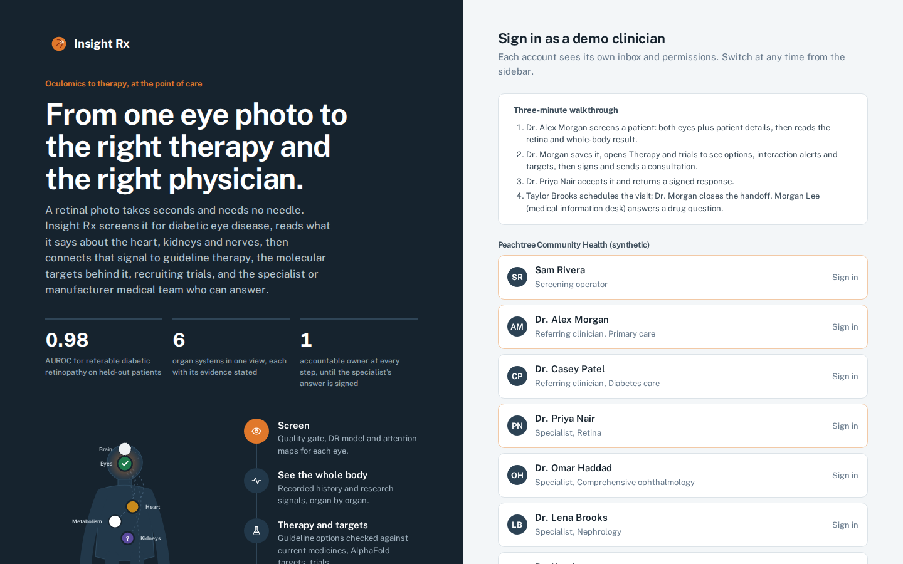

## 2. Screen a patient

On **Screen**:
1. Add photos for the **Right eye** and **Left eye** (JPEG or PNG). Large photos are resized in the browser.
2. Enter the patient details: age, sex, years with diabetes, insulin and oral medication. Leave anything unknown as *Unknown*.
3. Tick the patient's **current medicines**, or type others. These drive the interaction checks.
4. Press **Screen**. Results take about 10 seconds with the live models.

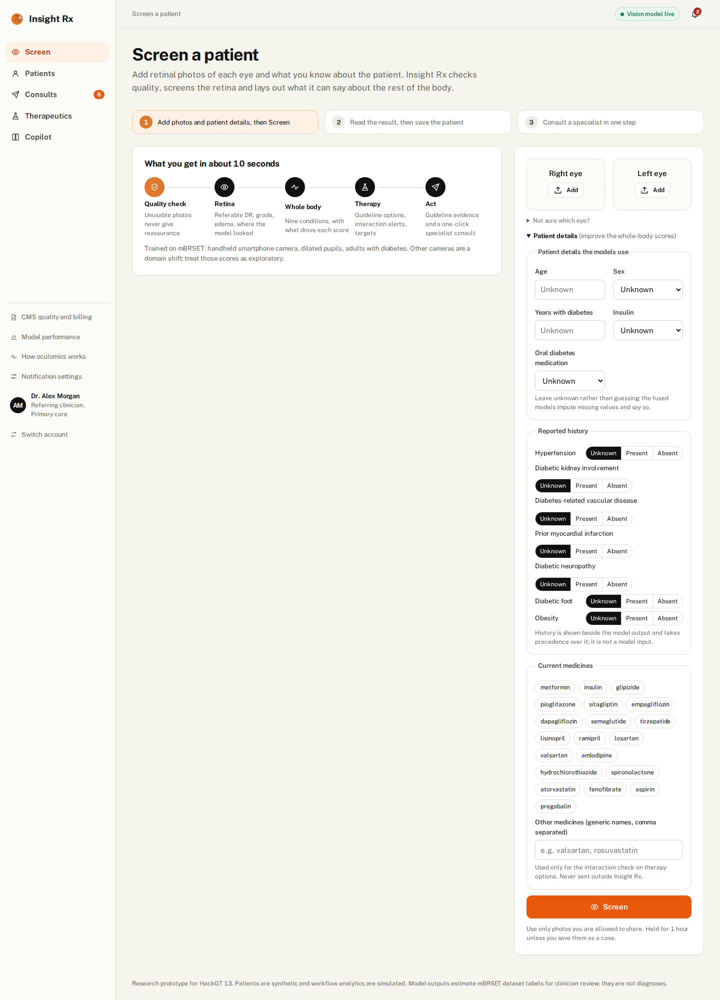

The result shows:
- **The retina, photo by photo:** a quality check, the referable-DR verdict, grade probabilities and a macular edema signal. Press **Where the model looked** to see the attention map.
- **The whole-body view:** heart, kidneys, nerves and metabolism, each labelled with its evidence tier (research signal, exploratory, known condition or no finding).
- **Every systemic condition:** the score against its threshold, and what moved it for this patient.

## 3. Personalised therapeutics

Still on the Screen result, before you save anything:

**Treatment considerations** lists the guideline therapy classes for the findings (ADA, AAO, KDIGO), each with its evidence tier and source. Interaction alerts are checked against the patient's medicines, including eye-specific ones such as *semaglutide with a retinopathy signal* and *pioglitazone with macular edema*.

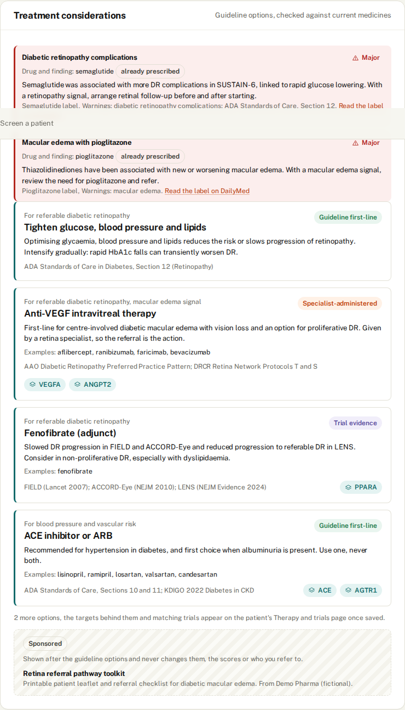

**Personalised therapeutics** ranks the protein targets the patient's phenotype points to. Each rank shows its reasons: the linked finding, guideline strength, how confidently the drug-binding site is predicted, and any interaction alerts. Click a target to open it with this patient's context.

Once the patient is saved, the case page's **Therapy and trials** tab has the same content, plus recruiting trials and the CMS quality and billing panel.

## 4. Protein targets and AlphaFold

**Therapeutics** (left navigation) lists the disease targets by organ system, with AlphaFold confidence and approved and pipeline drug counts. A target page shows:
- **An interactive 3D structure.** Drag to rotate, scroll to zoom, and use **Rotate** and **Reset view**. Toggle between the **Drug complex** (the real structure from the Protein Data Bank) and **AlphaFold** (the prediction coloured by pLDDT confidence).
- **Structure insights:** the residues touching the drug, with AlphaFold's confidence at that site, and the flexible regions.
- **Drugs acting on the target** (ChEMBL) and **recruiting trials** for the related findings.
- A **patient banner** when opened from a screening or case, showing that patient's rank and reasons.

| Drug complex (VEGF-A with an antibody) | AlphaFold prediction by confidence |
|---|---|
|  |  |

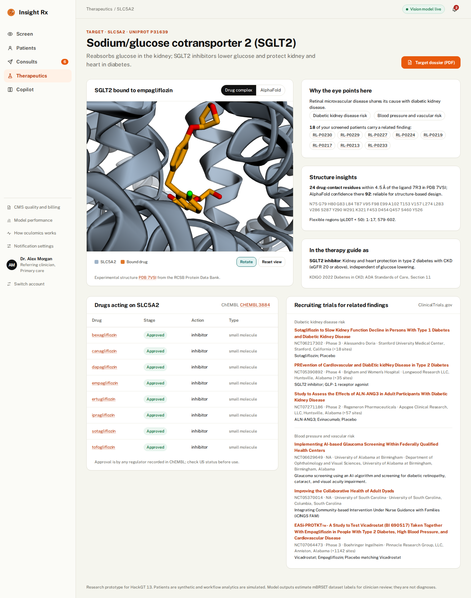
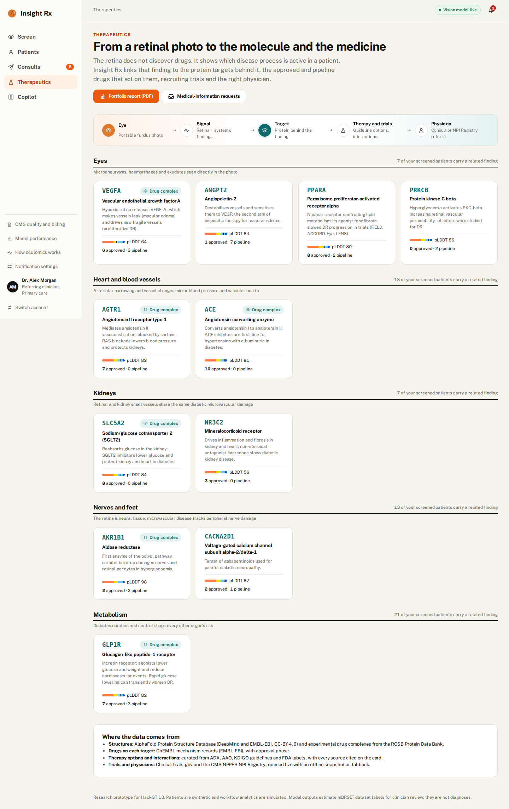

## 5. Save, sign and consult

1. On the Screen result, press **Save patient & consult a specialist**. Operators see **Save patient for clinician review** instead.
2. **Consult a specialist** walks you through three steps: confirm your reading, pick the question and the specialist, then sign and send.
3. The specialist must accept the consultation. The relay strip shows who holds the case at each step, and the coordinator schedules the visit.

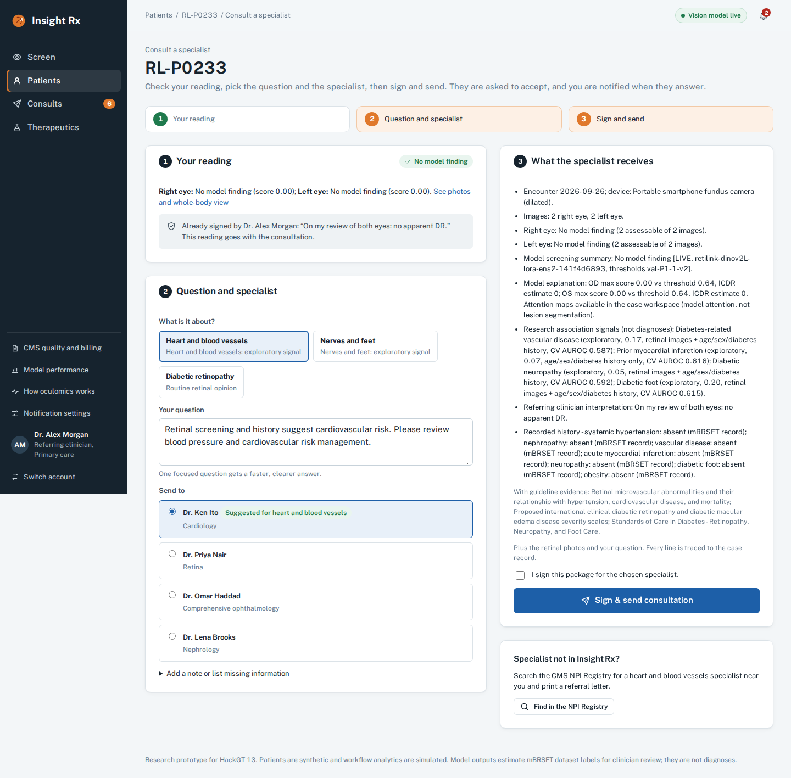
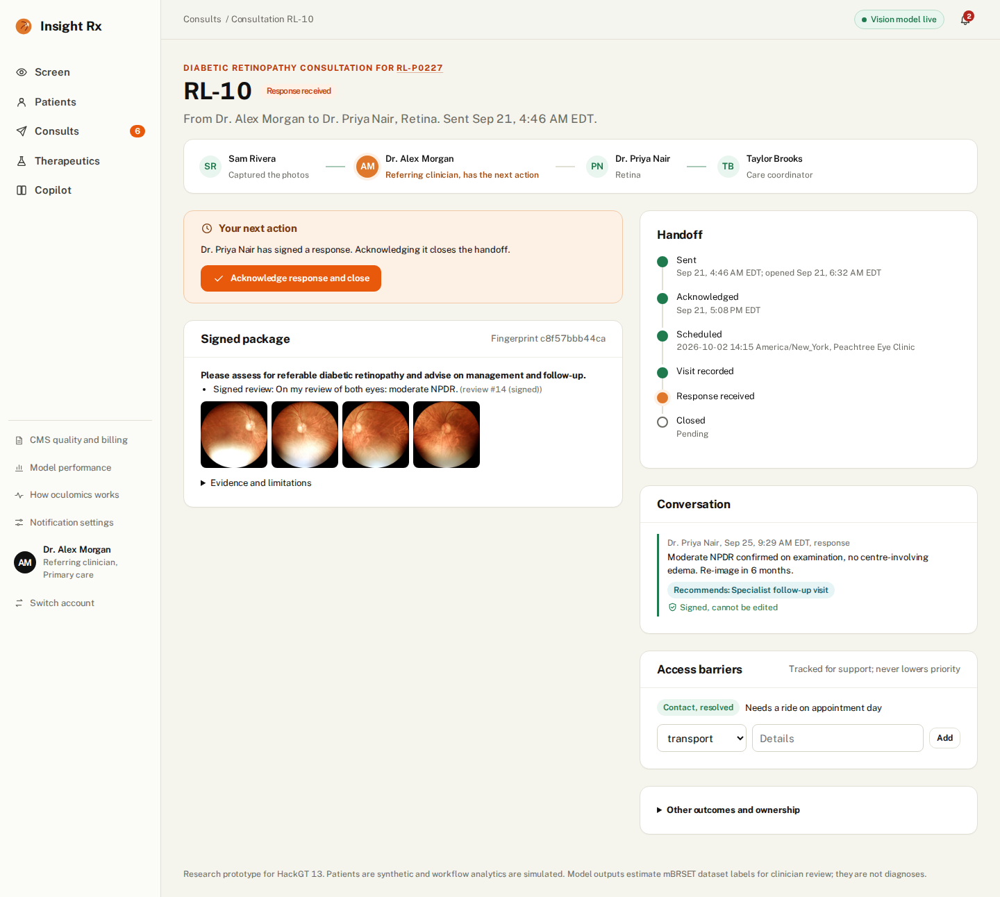

## 6. Refer outside your network (CMS NPI Registry)

On the consult page or the therapy page, choose **Find in the NPI Registry**. Pick the specialty and a ZIP code to list real clinicians from the CMS NPPES registry, then choose **Referral letter** to print or save a letter as PDF. Only the specialty and ZIP code are sent to the registry.

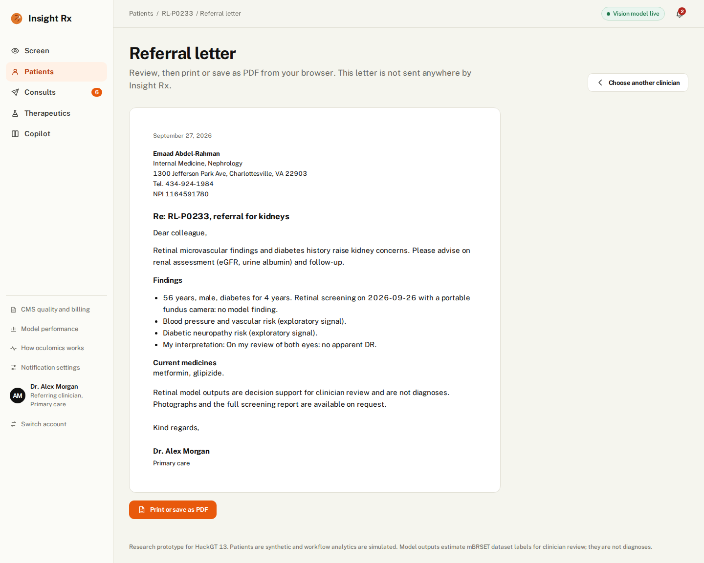

## 7. Medical-information requests

On any therapy option, open **Ask the manufacturer's medical-information team**, choose the drug and write your question.
- The desk sees your name, the drug, your question and an **age band plus the finding labels**. It never sees the patient reference, photos or history, and it cannot open cases.
- Answers arrive under **Therapeutics → Medical-information requests** and in your notifications.
- Sponsored content is always labelled and never changes the ranking, scores or referrals.

| Clinician view | Manufacturer desk |
|---|---|
| 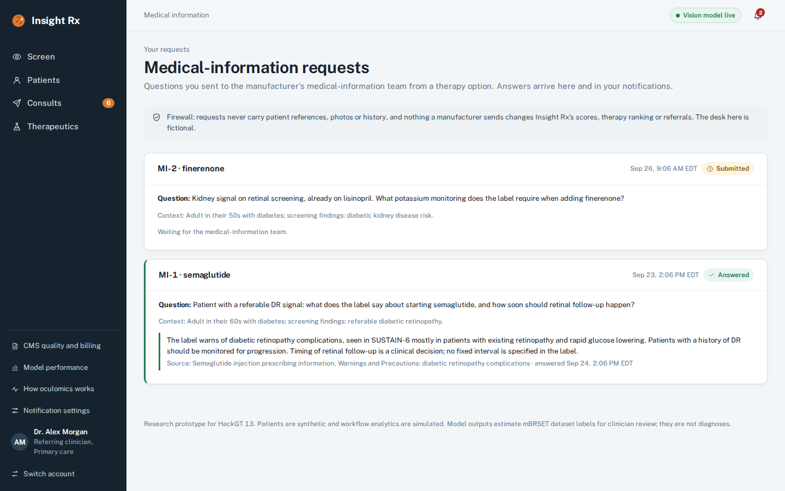 |  |

## 8. PDF reports

| Report | Where | Contents |
|---|---|---|
| Patient therapy and target report | Screen result (**Therapy and target report (PDF)**) or the case **Therapy and trials** page (**Report (PDF)**) | Summary, retina with photos, whole-body signals, therapy options, alerts, target priorities, trials, CMS status, and methods |
| Target dossier | Any target page (**Target dossier (PDF)**) | Key insights, structure snapshot, pLDDT track with domains and drug-contact residues, drug landscape, trials and sources |
| Portfolio report | **Therapeutics → Portfolio report (PDF)** | Opportunity matrix (eye-detected demand against drug crowding) and ranked targets |

Samples: [patient report](reports/patient_therapy_report.pdf) · [VEGF-A dossier](reports/target_dossier_VEGFA.pdf) · [ACE dossier](reports/target_dossier_ACE.pdf) · [portfolio](reports/portfolio_report.pdf)

## 9. Patients, consults and roles

**Patients** is your screened panel. It lets you search and open a case, and shows the panel's whole-body summary.

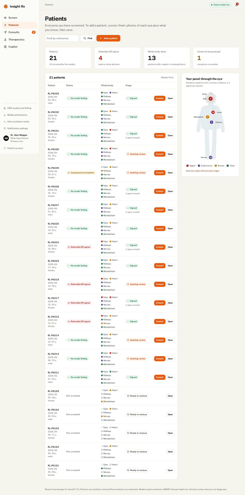

**Consults** is each role's action inbox: tasks with due times, consultations sent and received, and recent activity.

| Referring clinician | Specialist | Coordinator |
|---|---|---|
| 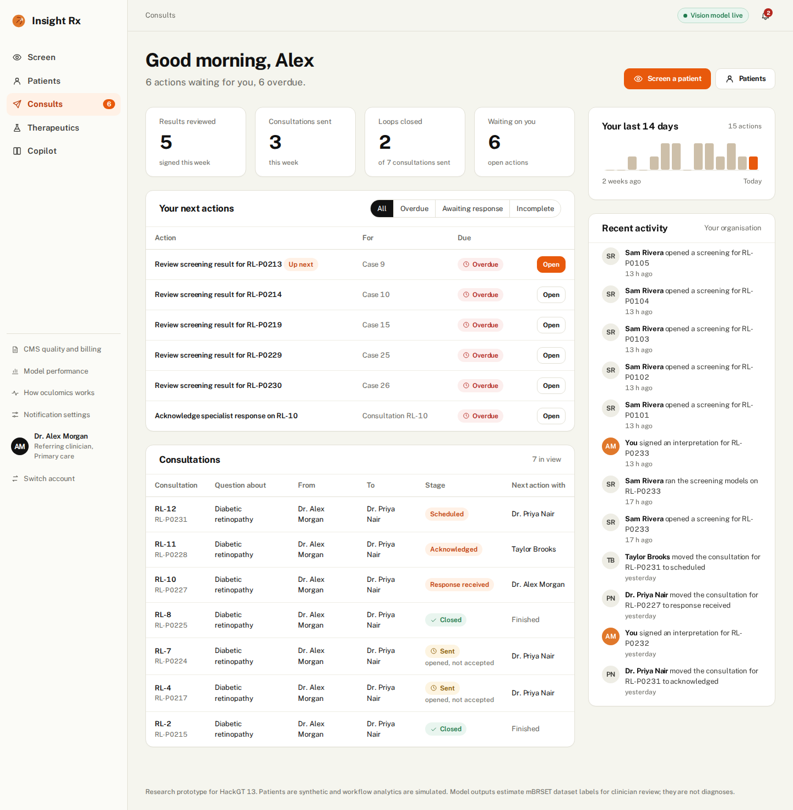 | 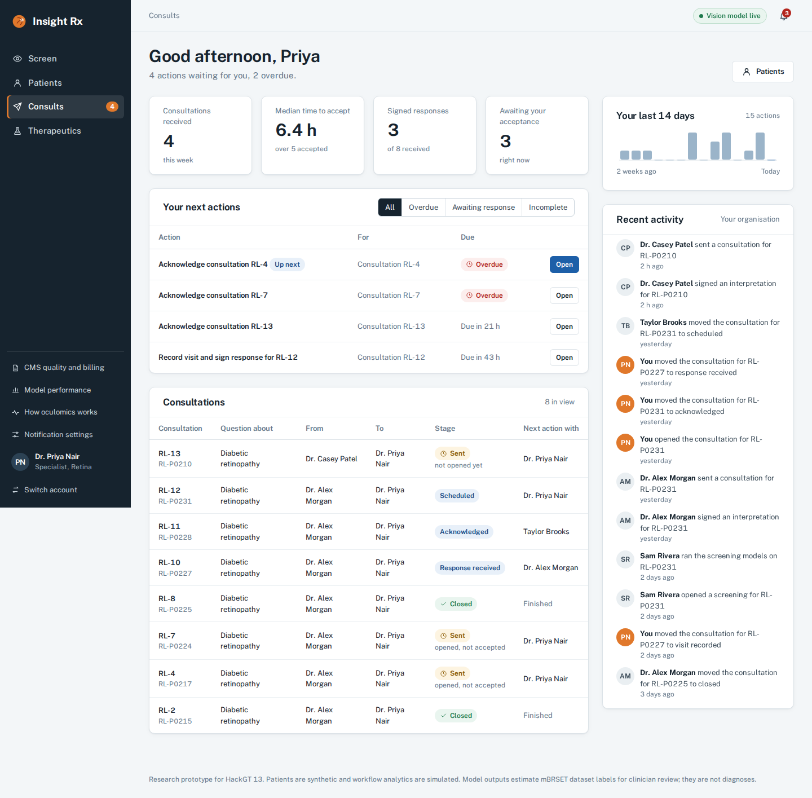 | 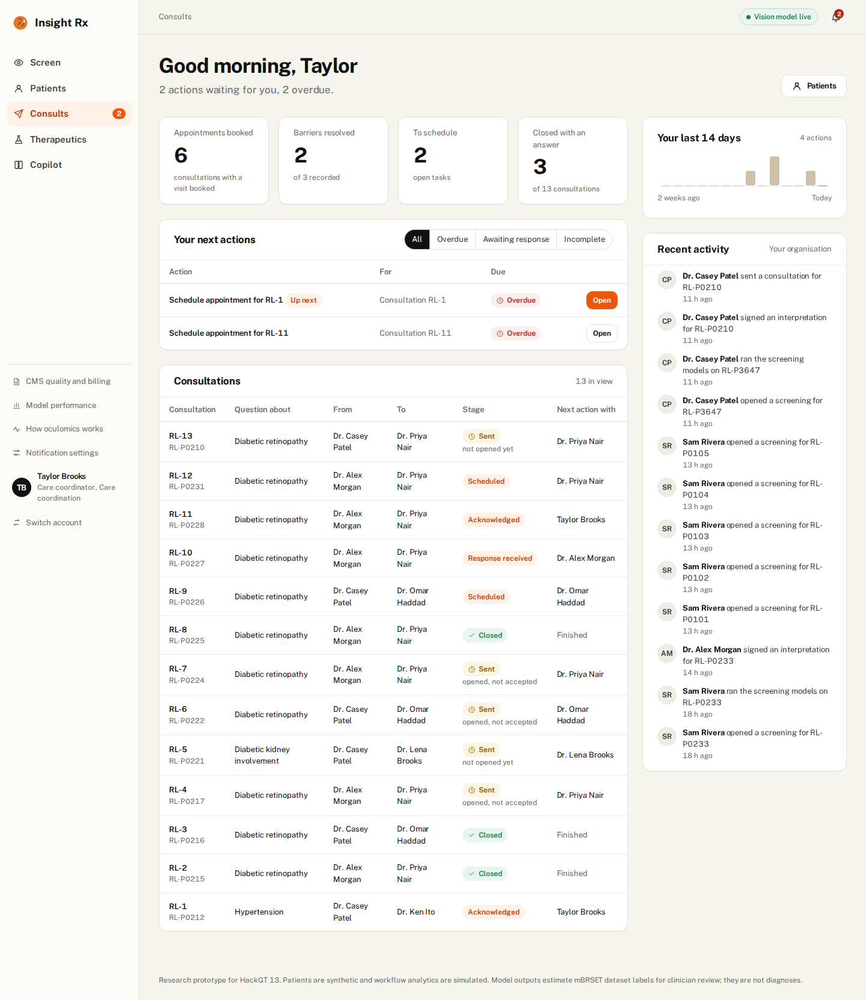 |

The case page has the following tabs:
- **Screening:** photos with attention maps, image quality and eye assignment.
- **Systemic health:** the inputs the models use; edit them and re-run.
- **Therapy and trials.**
- **Review and sign.**
- **Consultation.**
- **Consultations sent.**
- **Audit trail.**

| Case: screening | Case: whole body |
|---|---|
| 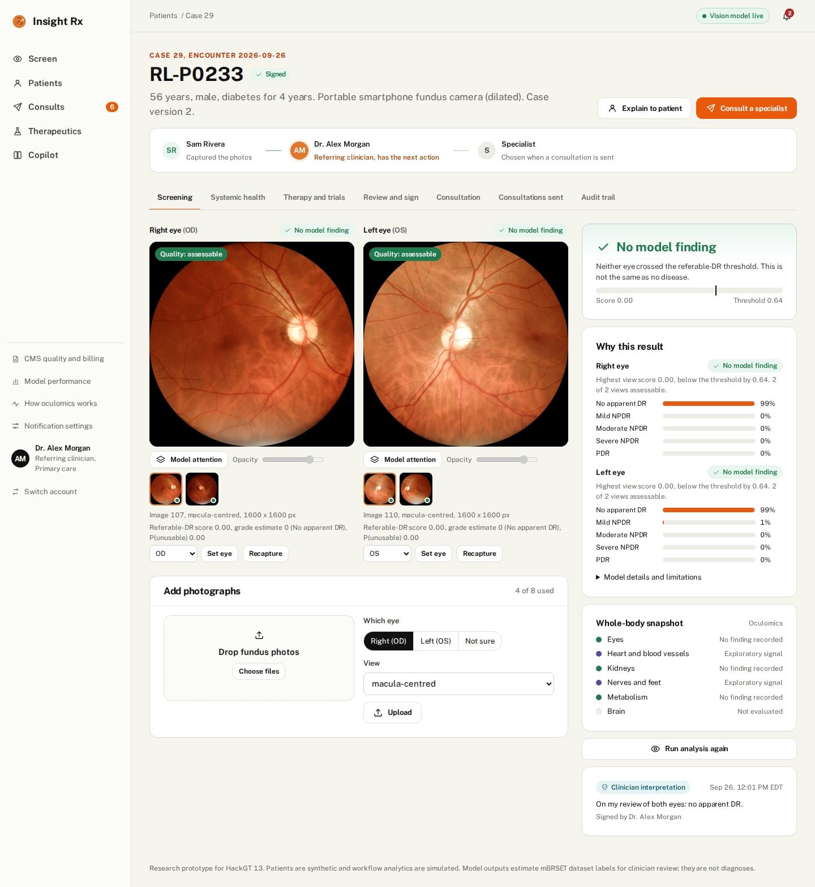 | 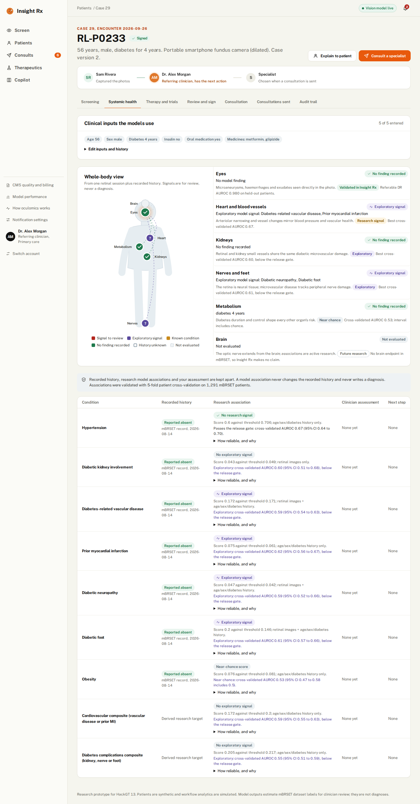 |

## 10. CMS quality and billing

**CMS quality and billing** (sidebar) shows how screening closes the diabetic eye exam gap (CMS131 / MIPS #117 and HEDIS EED) and which retinal-imaging CPT codes fit. CPT 92228 covers physician-read imaging. CPT 92229 needs an FDA-cleared autonomous system, which Insight Rx is not.

## 11. Model performance and how oculomics works

| Model performance | How oculomics works |
|---|---|
|  | 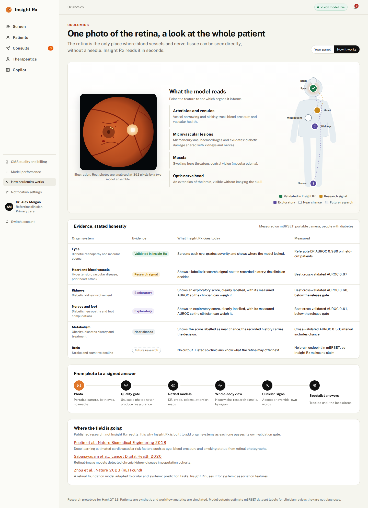 |

## 11b. Copilot

**Copilot** (sidebar) is a chat assistant for therapy classes, interactions, protein targets and CMS rules. Each patient's **Therapy and trials** page has its own copilot conversation that also sees a de-identified brief of that patient.
- Answers cite numbered passages from Insight Rx's curated knowledge; the chips under an answer show the sources and what it **remembered** about you.
- It learns your stated preferences (for example "I check eGFR before SGLT2 inhibitors") and uses them in later answers. See, add or delete memories on the right of the Copilot page.
- Memory is stored with Backboard.io, separate for every clinician; answers are written by Gemini.
- **Who sees it:** the general Copilot is available to the screening operator, clinicians, coordinator and admin; the patient-level copilot only to the referring and specialist clinicians on the case. The medical-information desk never sees it, and it is hidden everywhere when the deployment has no copilot configured.

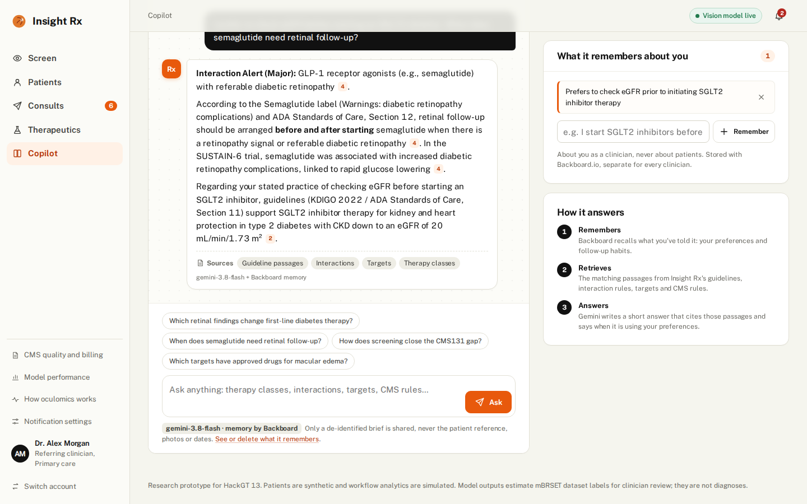

## 12. Explain the result to the patient

On a case with a completed analysis, **Explain to patient** (top right) opens a plain-language note to read or play to the patient, in **English** or **Português (Brasil)**.
- The note is built from categorical facts only: which eye shows signs, possible swelling, organs worth discussing, and the next step from your signed review. It contains no scores, names or identifiers.
- With a Gemini key, Gemini rewrites it in warm, simple words. A rewrite that adds any number or identifier, or drops content, is rejected, and the page says the template was used.
- With an ElevenLabs key, a player reads the note aloud with a natural multilingual voice.
- If the case is not signed yet, the page reminds you to review before sharing.

| English | Português (Brasil) |
|---|---|
| 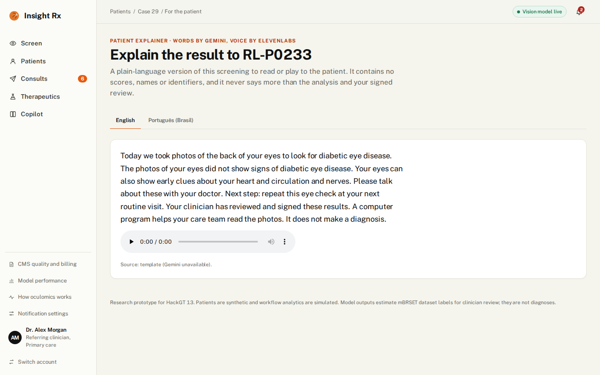 | 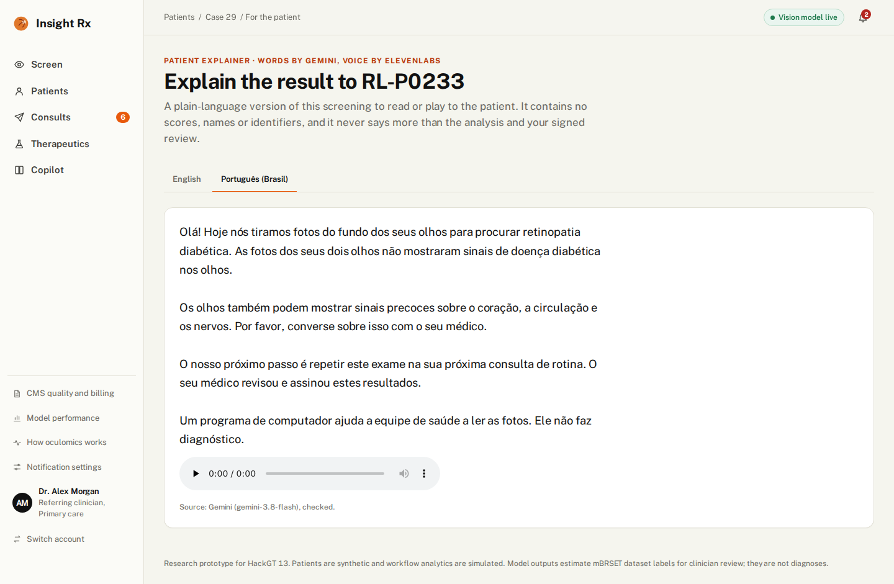 |

## 13. Finding trends

**Model performance → Finding trends** shows the last 30 days per day: patients screened, referable DR, macular edema, each systemic research signal, reviews signed and consultations sent. With `TIGER_DATABASE_URL` set, the series comes from a Tiger Data continuous aggregate; otherwise it is computed from the app database. Events are de-identified.

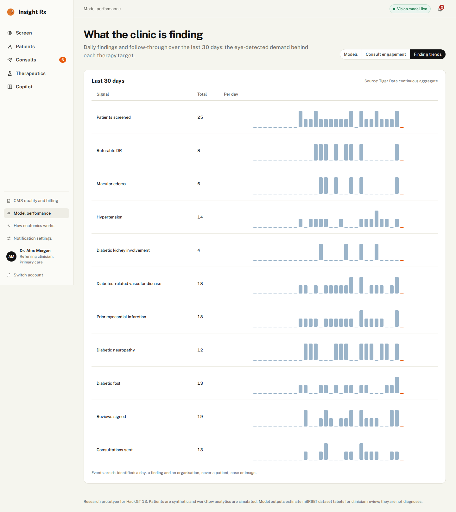

## 14. Verifiable signatures on Solana

When you sign a review or send a consultation, Insight Rx already computes a SHA-256 signature over the case version, images, model run and your interpretation. With Solana anchoring on, that digest (and nothing else) is written to the Solana blockchain. The **Audit trail** tab then shows **Anchored on solana** with a **Verify on Solana Explorer** link, so a record can be proven unchanged later without trusting the Insight Rx database.

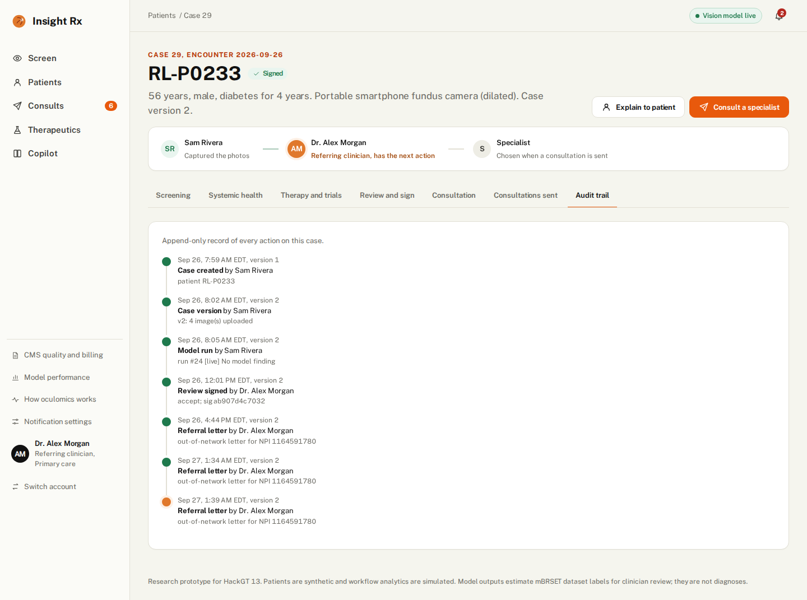

## 15. Tips and limits

- The top bar shows **Vision model live** when the GPU worker is online, and **simulated** otherwise. Simulated outputs are labelled everywhere.
- Photos on Screen are held for one hour. Save the patient to keep them.
- Unknown stays unknown: missing inputs are imputed and the page says so.
- The models are trained on mBRSET (a handheld smartphone camera, dilated eyes, adults with diabetes in Brazil). Other cameras are a domain shift.
- Everything works on a phone.

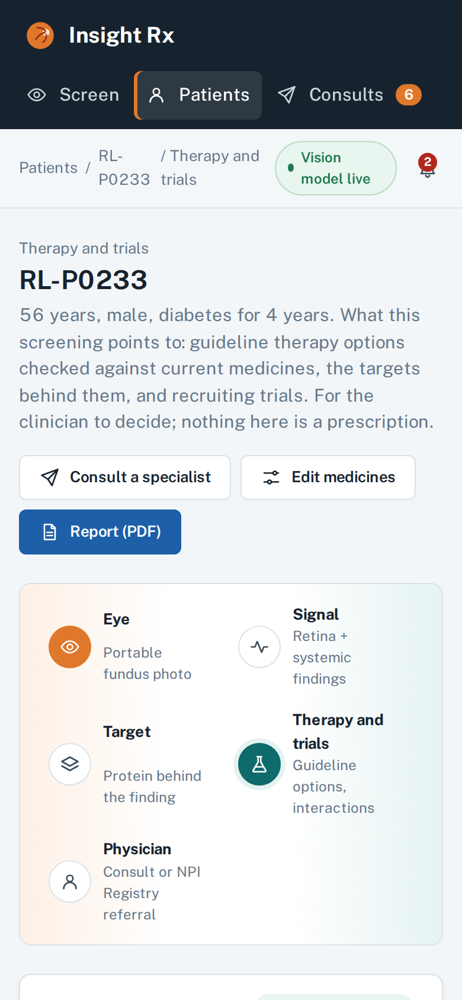
